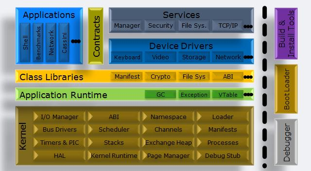

# This project is a copy of https://archive.codeplex.com/?p=singularity . 

# Singularity-RDK

The Singularity Research Development Kit (RDK) is a Shared Source project based on the Singularity research project out of Microsoft Research. The Singularity RDK is available for academic non-commercial use only. Singularity is a research project focused on the construction of dependable systems through innovation in the areas of systems, languages, and tools. We are building a research operating system prototype (called Singularity), extending programming languages, and developing new techniques and tools for specifying and verifying program behavior. Advances in languages, compilers, and tools open the possibility of significantly improving software. For example, Singularity uses type-safe languages and an abstract instruction set to enable what we call Software Isolated Processes (SIPs). SIPs provide the strong isolation guarantees of OS processes (isolated object space, separate GCs, separate runtimes) without the overhead of hardware-enforced protection domains. Singularity uses these advances to build more reliable systems and applications. For example, because SIPs are so cheap to create and enforce, Singularity runs each program, device driver, or system extension in its own SIP. SIPs are not allowed to share memory or modify their own code. As a result, we can make strong reliability guarantees about the code running in a SIP. We can verify much broader properties about a SIP at compile or install time than can be done for code running in traditional OS processes. Broader application of static verification is critical to predicting system behavior and providing users with strong guarantees about reliability.

 
**Announcement: A new major release, RDK 2.0, is now available!** Download source code or a bootable ISO at the Releases tab, or retrieve the latest Source Code from the repository at the Source Code tab.

## Project Description

The Singularity Research Development Kit (RDK) is based on the [Microsoft Research](http://research.microsoft.com/) [Singularity Project](http://research.microsoft.com/os/singularity). It includes source code, build tools, test suites, design notes, and other background materials. The Singularity RDK is for academic non-commercial use and is governed by this [license](LICENSE).

## About Singularity

Singularity is a research project focused on the construction of dependable systems through innovation in the areas of systems, languages, and tools. We are building a research operating system prototype (called Singularity), extending programming languages, and developing new techniques and tools for specifying and verifying program behavior.

Advances in languages, compilers, and tools open the possibility of significantly improving software. For example, Singularity uses type-safe languages and an abstract instruction set to enable what we call Software Isolated Processes (SIPs). SIPs provide the strong isolation guarantees of OS processes (isolated object space, separate GCs, separate runtimes) without the overhead of hardware-enforced protection domains. In the current Singularity prototype SIPs are extremely cheap; they run in ring 0 in the kernel’s address space.

Singularity uses these advances to build more reliable systems and applications. For example, because SIPs are so cheap to create and enforce, Singularity runs each program, device driver, or system extension in its own SIP. SIPs are not allowed to share memory or modify their own code. As a result, we can make strong reliability guarantees about the code running in a SIP. We can verify much broader properties about a SIP at compile or install time than can be done for code running in traditional OS processes. Broader application of static verification is critical to predicting system behavior and providing users with strong guarantees about reliability.

See also:

[Singularity: Rethinking Dependable System Design](http://research.microsoft.com/en-us/news/features/singularity.aspx)

[Singularity: Rethinking the Software Stack](http://research.microsoft.com/apps/pubs/default.aspx?id=69431)

[Using the Singularity Research Development Kit](http://research.microsoft.com/en-us/projects/singularity/asplos2008_singularity_rdk_tutorial.pdf)

